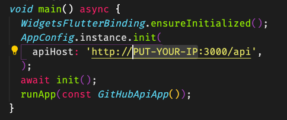
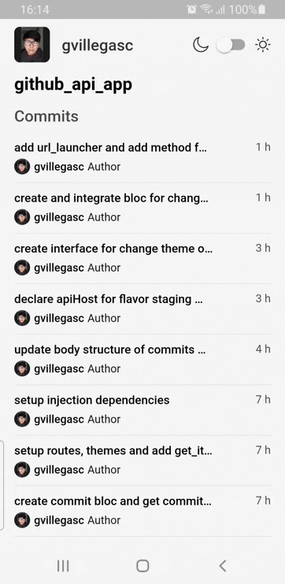
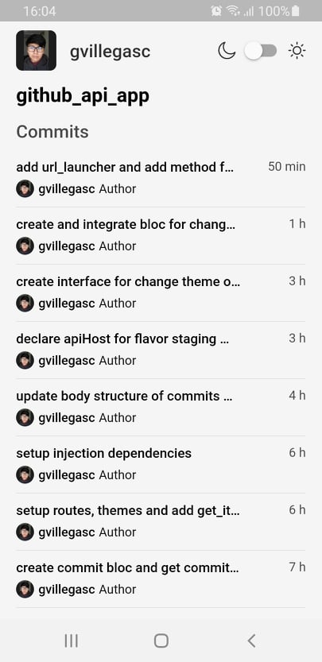
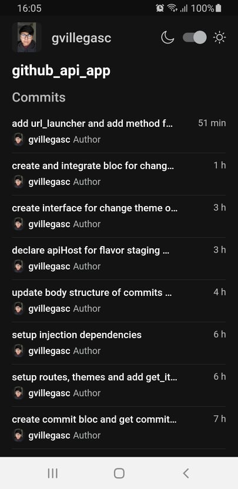
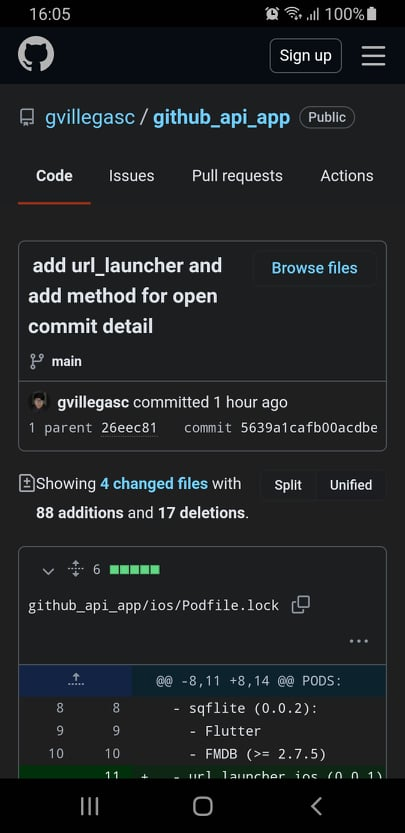

# Github Api App

Github Api App is a mobile application show some my flutter skills this project use Clean Architecture, Bloc, Injection dependencies, some unit test and more, And a backend for show some nodejs skills

## Getting Started for NodeJS Api

### Pre-requisites

For run this application you must install [NodeJS](https://nodejs.org/es/) one of last versions.

### Installation
After to clone the repository open a console on the folder and move to the `github_api`
```bash
# move to the nodejs api project
cd github_api
```
Next download the `nodejs` dependencies with:
```bash
# get dependencies
npm install
```
### Usage

Next to download dependencies you have to run the following command for start to run the service of the api.

```bash
# run the api
npm run dev
```
The service will be running on port 3000 of your computer for default.

You can know if the service is running opening the following url in your computer.

```bash
# url of services
http://localhost:3000/api
```

<br>

## Getting Started for Flutter App

### Pre-requisites

For run this application you must install [Flutter](https://flutter.dev/) 2.0 or higher.

You can know how to install flutter [here](https://flutter.dev/docs/get-started/install)

### Installation

After to clone the repository open a console on the folder and move to the `github_api_app` folder

```bash
# move to the app project
cd github_api_app
```
Next download the `flutter` dependencies with:
```bash
# get dependencies
flutter pub get
```

### Usage

Next to download dependencies you have to have an android emulator or ios emulator switched on and execute the following command.

The mobile app has three environments development, staging and production

```bash
# run in development environment
flutter run --target lib/main_development.dart --flavor development
```
```bash
# run in staging environment
flutter run --target lib/main_staging.dart --flavor staging
```
```bash
# run in production environment
flutter run --target lib/main_production.dart --flavor production
```
NOTE** if you want run the app on the development environment is necessary start the nodejs api (`github_api`), you can see [here](#getting-started-for-nodejs-api) and put only your ip in the apiHost variable in the file `lib/main_development.dart`.




### App images
<table>
    <tr>
        <th>App</th>
        <th>Commits Page Light</th>
    </tr>
	<tr>
        <td></td>
        <td></td>        
	</tr>
</table>

<table>
    <tr>
        <th>Commits Page Dark</th>
        <th>Detail Commit</th>
    </tr>
	<tr>
        <td></td>
        <td></td>
	</tr>
</table>

### Run unit test

To run the unit tests you must run the following command remember that to run the tests is necessary to install the dependencies

```bash
flutter test
```

## Builded with

- [Flutter](https://flutter.dev/) - SDK for develop
- [NodeJS](https://nodejs.org/es/)

## Author

- **Gerardo Villegas** - [gvillegasc](https://github.com/gvillegasc)
